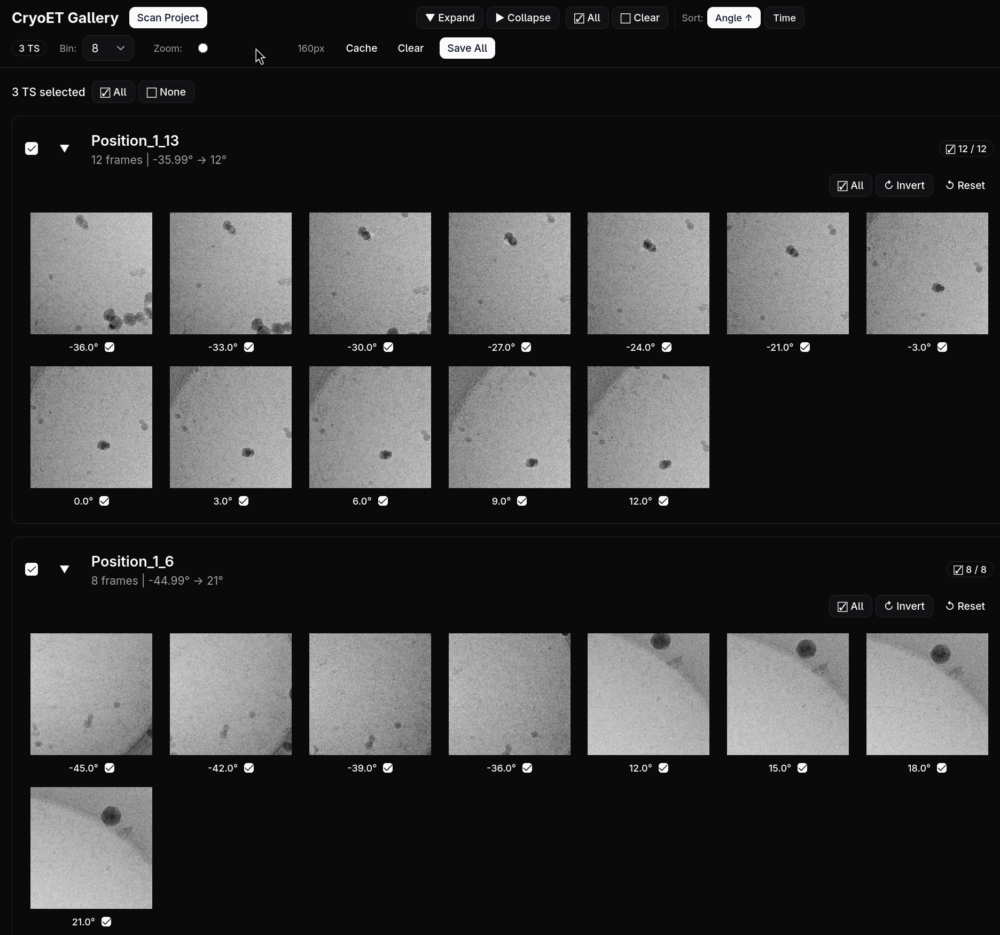

# CryoET Tilt Series Curator

A web application for **Cryo-ET tilt series filtering, inspection, and visualization**.
Point your browser at it, scan a project directory, and start curating.



---

## Quick Start (for end users)

### 1. Download the latest release

Download `ts-go-*.tar.gz` from the [releases page](https://github.com/elemeng/ts_go/releases).

No Rust, Deno, or any other toolchain is required — the tarball is fully self-contained.
The backend binary is **statically linked with musl** — it runs on **any Linux distribution** regardless of glibc version.

### 2. Unpack on the machine where your data lives

```bash
tar xzf ts-go-*.tar.gz
cd ts-go-release
```

The server should run on the same machine (or same network filesystem) where your MRC and mdoc files are stored. It does not need GPU or large memory — a typical HPC login node or lab workstation is fine.

### 3. Run the server

```bash
./run.sh
```

The server listens on port **8088** by default. If the port is busy, it automatically tries the next one.

### 4. Open the browser

On any computer that has network access to the server, open:

```
http://<server-ip>:8088
```

That's it. You will see the **CryoET Tilt Series Curator** interface. Click **Scan Project**, point it at your mdoc and MRC directories, and start curating.

---

### Example scenario

> **Tom** has motion-corrected movies converted to MRC files on a remote HPC machine named `cryo-em-001`. He has mdoc files alongside them describing the tilt series.
>
> Tom downloads the release tarball on `cryo-em-001`:
> ```bash
> scp ts-go-20260715.tar.gz tom@cryo-em-001:~/curation/
> ssh tom@cryo-em-001
> cd ~/curation
> tar xzf ts-go-20260715.tar.gz
> cd ts-go-release
> ./run.sh
> ```
>
> The server starts and prints:
> ```
> ✅ Server started on port 8088
>    → App:  http://localhost:8088
>    → API:  http://localhost:8088/api/
> ```
>
> Tom notes the server's IP (`cryo-em-001` = `10.20.30.40`), then opens a browser on his laptop:
> ```
> http://10.20.30.40:8088
> ```
>
> He clicks **Scan Project**, fills in his mdoc and MRC directories, and starts curating.

---

### Port configuration

If port 8088 is occupied, set a custom one:

```bash
PORT=9090 ./run.sh
```

Or let it auto-scan a range:

```bash
PORT=8088 PORT_MAX_TRIES=100 ./run.sh
```

---

### Stopping the server

Press `Ctrl+C` in the terminal where `run.sh` is running.

---

## Features

- **Tilt Series Curation** — Browse, inspect, and curate Cryo-ET tilt series interactively
- **Frame-level Selection** — Select, invert, reset, and persist frame selections per tilt series
- **Batch Operations** — Select all / clear all frames across multiple tilt series at once
- **Binning Control** — Adjust PNG preview binning (1x, 2x, 4x, 8x) from the toolbar
- **Sorting** — Sort frames by tilt angle (ascending) or by acquisition time (DateTime from mdoc)
- **Deleted Frame Recovery** — "Show Deleted" toggle reveals removed frames with a pink dashed outline; re-select and save to restore
- **Image Matching** — Configurable prefix/suffix cuts for matching mdoc entries to image files by name
- **High Performance** — LRU PNG caching (2GB), in-flight request deduplication, efficient MRC→PNG pipeline
- **MRC Support** — Reads MRC mode 0/1/2/6/12 (Int8, Int16, Float32, Uint16, Float16) and TIFF files
- **Automatic Backups** — Timestamped `.mdoc.{timestamp}.bak` files on every destructive operation
- **Self-contained** — No Rust, Deno, Node.js, or Python required at runtime

---

## API Overview

| Method | Endpoint | Description |
|--------|----------|-------------|
| POST | `/api/mdoc/scan` | Scan directory for mdoc files |
| GET | `/api/mdoc/list` | List all tilt series |
| GET | `/api/mdoc/{ts_id}` | Get specific tilt series |
| POST | `/api/mdoc/save-all` | Save frame selections for multiple mdocs |
| POST | `/api/mdoc/delete-all` | Delete mdoc files (with timestamped backup) |
| POST | `/api/mdoc/batch-save` | Save frame selections for a single mdoc |
| POST | `/api/mdoc/backup-delete` | Backup and delete a single mdoc |
| GET | `/api/preview/{ts_id}/{frame_id}?bin=8` | Get PNG preview of a frame |
| GET | `/api/preview/{ts_id}/frame-mtimes?bin=8` | Get disk mtimes for all frames |
| GET | `/api/preview/capabilities` | PNG generation options |
| GET | `/api/files/user-home` | User home directory |
| GET | `/api/files/list?path=/data` | List directory contents |
| POST | `/api/files/save-config` | Save scan configuration |
| GET | `/api/files/load-config?filename=...` | Load scan configuration |
| GET | `/api/files/list-configs` | List saved configurations |
| DELETE | `/api/files/delete-config?filename=...` | Delete saved configuration |
| GET | `/health` | Health check |

---

## For Developers

### Prerequisites

| Tool | Version | Purpose |
|------|---------|---------|
| **Deno** | 2.9+ | Frontend toolchain |
| **Rust** | 1.80+ | Backend compiler |

### Build release tarball

```bash
# Prerequisites: musl-gcc (for fully static binary)
# Ubuntu/Debian: sudo apt install musl-tools
# Fedora/RHEL:   sudo dnf install musl-gcc

./build-release.sh
```

This produces `ts-go-{date}.tar.gz` — the same format as the downloadable releases.

The backend is built with `x86_64-unknown-linux-musl` target, producing a **fully statically linked binary** that runs on any Linux distribution without any dependencies.

### Development mode

```bash
# Terminal 1: Backend (serves API on port 8088)
cd backend && cargo run

# Terminal 2: Frontend dev server (port 3000, proxying API to backend)
cd frontend && NEXT_PUBLIC_API_BASE=http://localhost:8088 deno task dev
```

Open http://localhost:3000 (Next.js dev server with hot reload).

**Note:** In production, the Rust backend serves both the API and the static frontend on a single port. In dev mode, the frontend dev server runs on port 3000 and the backend on 8088; set `NEXT_PUBLIC_API_BASE` so the frontend knows where to find the API.

### Environment Variables

| Variable | Default | Description |
|----------|---------|-------------|
| `PORT` | `8088` | Backend listen port |
| `PORT_MAX_TRIES` | `10` | Number of ports to try if busy |
| `FRONTEND_DIR` | `./frontend` | Path to static frontend files |
| `CORS_ORIGIN` | (any) | Restrict CORS to a specific origin (e.g. `http://localhost:3000`) |
| `NEXT_PUBLIC_API_BASE` | (empty) | Dev-mode API base URL (frontend) |

### Project structure

```
ts_go/
├── frontend/          # Next.js 16 + React UI
├── backend/           # Rust + Axum API server
│   ├── src/
│   │   ├── routes/    # API endpoints (mdoc, preview, files, health)
│   │   ├── mdoc/      # MDOC parsing & writing
│   │   ├── image/     # Image processing (read, bin, contrast, encode)
│   │   ├── cache/     # LRU memory cache
│   │   ├── matcher/   # File name matching with prefix/suffix cuts
│   │   ├── state/     # In-memory project state
│   │   └── models/    # Shared types
│   └── Cargo.toml
├── e2e/               # End-to-end test (Playwright)
├── test/              # Test data (mdoc, mrc, png)
├── docs/              # Documentation
├── scripts/           # Launcher scripts
├── build-release.sh   # Release tarball builder
├── test.sh            # Integration test script
└── port_free.sh       # Port scanning utility
```

### Image pipeline

```
MRC/TIFF file → Array2<f32> → binning → autocontrast → PNG bytes
```

Operates entirely in **f32** precision. Source data is read in its native mode and converted to f32 at the read boundary.

### Testing

```bash
cd backend && cargo test              # Backend unit tests
deno run --allow-all e2e/scan-and-view.ts   # E2E test (Playwright)
./test.sh                             # Full release pipeline test
```

---

## License

MIT License.
